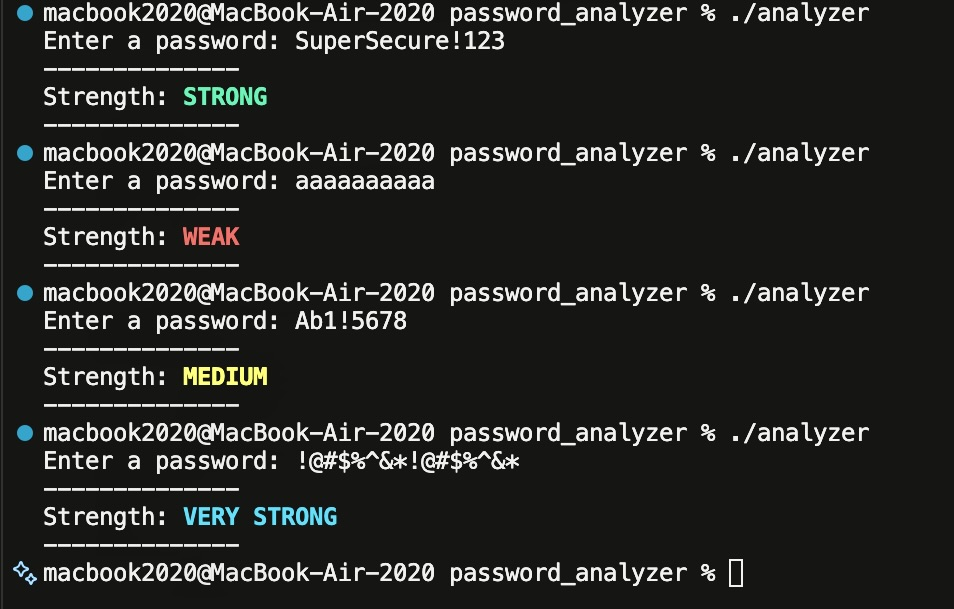

## 🛡️ Password Strength Analyzer (C)

A simple, command-line tool written in C that evaluates password complexity based on length, character variety, and common weak patterns. The results are displayed with high-visibility, color-coded strength levels.

## ✔️ Password Requirements
Minimum length of 8 characters.

## ✔️ Strength Evaluation Logic
The analyzer calculates a score based on the following criteria:

| Category | Criterion | Score Impact |
| :--- | :--- | :--- |
| **Variety** | Contains Lowercase | +1 |
| **Variety** | Contains Uppercase | +1 |
| **Variety** | Contains Digits | +1 |
| **Variety** | Contains Special Characters | +1 |
| **Bonus** | Length > 9 | +1 |
| **Bonus** | Length > 12 | +2 |
| **Penalty** | Consecutive Repeated Chars (>4) | -1 |
| **Penalty** | Single-type only (e.g., only digits) | -1 |

### ✔️ Visual Feedback
Scores are mapped to colored terminal output for immediate readability:
* <span style="color:red">**WEAK**</span> (Score ≤ 2)
* <span style="color:yellow">**MEDIUM**</span> (Score 3–4)
* <span style="color:green">**STRONG**</span> (Score 5–7)
* <span style="color:cyan">**VERY STRONG**</span> (Score 8+)

---

##  Demo

The following screenshot demonstrates the analyzer in action, showcasing the logic for different complexity levels and terminal color output:



---

## 📦 File Structure
```text
password_analyzer/
│── main.c          # Core program logic
└── README.md       # Project documentation
```
---
## How to Compile
```bash
gcc main.c -o analyzer
./analyzer
```
